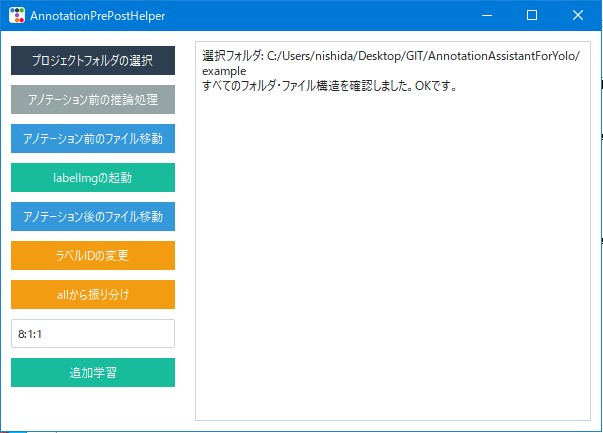

# AnnotationAssistantForYolo

YOLO形式のアノテーションを効率的に行うためのGUIツールです。（Pythonスクリプトです）
プロジェクトフォルダの管理、予測処理、ファイルの振り分けや移動、ラベルID変更、追加学習支援などの機能を備えています。

---

## 主な機能の概要

* プロジェクトフォルダの選択とフォルダ構造の確認（「1. プロジェクトフォルダの準備」を参照）
* アノテーションを行う前にYOLOモデルを使ってバウンディングボックスの作成
* アノテーション前後のファイル移動（`labels` ⇔ `images`）
* labelImgの起動（ラベル編集ツール）
* ラベルIDの一括変更（CSVファイルによるマッピング）
* `all` フォルダ内の画像ファイルを指定比率で `train` / `valid` / `test` に振り分け
* 追加学習用の `train.py` スクリプトの実行サポート

など

---

## 使い方

### 1. プロジェクトフォルダの準備

以下のフォルダ構造を用意してください。(フォルダ内は空でも良い)


```
project_folder/
├─ images/
│  ├─ train/
│  ├─ valid/
│  ├─ test/
│  └─ all/
├─ labels/
│  ├─ train/
│  ├─ valid/
│  ├─ test/
│  └─ all/
├─ classes.txt
├─ data.yaml
└─ train.py
```

* `classes.txt` はクラス名を列挙したテキストファイル
* `data.yaml`はYOLOの学習や推論で使われるデータセットのメタ情報を記述するファイルです。
  - train: 学習用画像フォルダのパス  
  - val: 検証用（バリデーション）画像フォルダのパス  
  - test（任意）: テスト用画像フォルダのパス  
  - nc: クラス数（ラベルの種類数）  
  - names: クラス名の一覧（クラスIDに対応したラベル名のリスト）
* `train.py` は追加学習用のスクリプト

### 2. ツールの起動

```bash
python AnnotationAssistantForYolo.py
```

GUIが立ち上がります。  

### 3. 各操作



| ボタン名                  | 説明                                                          |
|---------------------------|---------------------------------------------------------------|
| プロジェクトフォルダの選択 | YOLO形式のプロジェクトフォルダを選択しフォルダ構造を検証          |
| アノテーション前の推論処理     | 学習済みYOLOモデル(.pt)を選択し、`test`、`train`、`valid`、`all`内の画像に対して推論しラベルを生成（[画像ファイル名].txtが無い場合のみ） |
| アノテーション前のファイル移動 | `labels` 内のtxtファイルを `images` フォルダへ移動し、classes.txtをコピー（labelImgでの作業性向上）    |
| labelImgの起動               | labelImg.exeを起動し、選択したフォルダのラベルを編集する              |
| アノテーション後のファイル移動 | `images` 内のtxtファイルを `labels` フォルダへ戻し、images内のclasses.txtを削除（学習のためのフォルダ構造に戻す） |
| ラベルIDの変更                | before-after形式のCSVを読み込み、指定されたラベルIDを一括変更             |
| allから振り分け               | `all/images` の画像を指定した比率（例：8:1:1）で `train`、`valid`、`test` に振り分け |
| 追加学習                      | プロジェクト内の `train.py` を指定のPythonで実行                    |

### 4. ラベルID変更用のCSVの形式

CSVはヘッダに `before`, `after` を含める必要があります。

```csv
before,after
0,1
2,3
```

---

## カスタマイズ

- `PYTHON_CMD` にPython実行コマンドのフルパスを設定してください。  
  例：`C:/WinPython3.10dot/python-3.10.11.amd64/python.exe` 

- `labelImg` のパスはPython実行コマンドの隣接 `Scripts/labelImg.exe` にある想定です。  
  違う環境の場合はコード内 `run_labelimg` メソッドを修正してください。

---

## 注意事項

- フォルダ名やファイル構成は固定の形を期待しています（`train`, `valid`, `test`, `all` にそれぞれ `images`/`labels` サブフォルダ）。  
- 予測処理は大量の画像で時間がかかる場合があります。UIは非同期処理しますがPCの性能に依存します。  
- 追加学習は `train.py` の内容に依存します。スクリプトが正常に動くことを事前に確認してください。  
- このツールではファイルの移動・コピーを行います。重要なデータはバックアップを推奨します。
- AnnotationAssistantForYolo.pyの内容を生成AIに貼り付けて、「改造できる？」と聞いて、後はご自由に改変してください。

---

## ライセンス

このツールのライセンスは特に記載がない限りMITライセンス等を想定してください。  
本ソフトウェアを利用する際の損害等についての責任は負いかねます。

---

## 免責事項

本ソフトウェアを使用する際は自己責任でお願いいたします。  
利用により生じた損害等について一切の責任を負いかねます。

---

